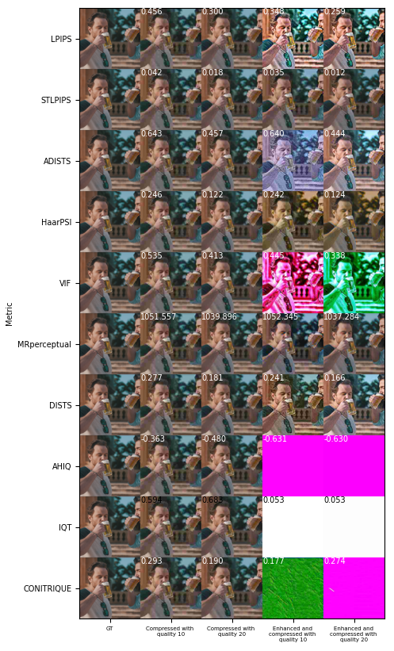
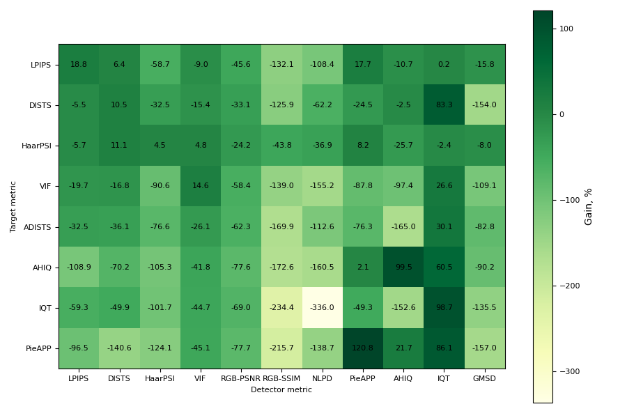

<p align="center">

  <h2 align="center">Unveiling the Limitations of Novel Image Quality Metrics</h2>
  <p align="center">
    <a href="https://scholar.google.com/citations?user=Siniukov"><strong>Maksim Siniukov</strong></a>
    ·  
    <a href="https://scholar.google.com/citations?user=G4o5vpAAAAAJ"><strong>Dmitriy Kulikov</strong></a>
    ·
    <a href="https://scholar.google.com/citations?user=545J9E4AAAAJ"><strong>Dmitriy Vatolin</strong></a>
    <br>
    Published in: <em>MMSP '23: 2023 IEEE 25th International Workshop on Multimedia Signal Processing</em>
    <br>
    </br>
        <a href="https://ieeexplore.ieee.org/document/10337674">
        </a>
     </br>
  </p>

</p>

## Abstract

Subjective image quality measurement plays a crucial role in the advancement of image-processing technologies. The primary goal of a visual quality metric is to reflect subjective evaluation results. Despite the rapid development of these metrics, their potential limitations have not been sufficiently explored. This research paper aims to address this gap by demonstrating how image preprocessing before compression can artificially inflate the quality scores of widely used metrics such as DISTS, LPIPS, HaarPSI, VIF, STLPIPS, ADISTS, MR-Perceptual, AHIQ, IQT, and CONTRIQUE. We present several CNN-based preprocessing models that significantly increase these metrics when images are JPEG-compressed. However, a subjective assessment (with 1027 participants) of preprocessed images reveals that the visual quality either decreases or remains unchanged, thereby challenging the universal applicability of these metrics. The detection of metric attacks integrated into image processing systems has emerged as a significant issue. Attack detection can be achieved by comparing subjective evaluation results with metric results. If these results are anticorrelated, it suggests that the metric has been attacked. However, the time-consuming nature of subjective evaluations and the need for numerous participants make them impractical for routine attack detection. To address this, we propose using other metrics to determine whether the target metric has been attacked. Our results show that attacking one metric affects the output of other metrics, offering a potential method for attack detection.


## Key Findings

- **Metric Vulnerability**: Widely used image quality metrics can be artificially inflated through preprocessing, with gains of up to **98%**.
- **Subjective-Objective Gap**: In many cases, higher metric scores did not indicate improved subjective visual quality, suggesting these metrics may not reliably reflect true subjective visual quality.
- **Metric Attack Detection**: A cross-metric approach is proposed to detect metric attacks without relying on subjective assessment.

In our study we evaluated the following metrics:

* **DISTS**
* **LPIPS**
* **HaarPSI**
* **VIF**
* **STLPIPS**
* **ADISTS**
* **MR-Perceptual**
* **AHIQ**
* **IQT**
* **CONTRIQUE**

**Note:** Each metric was studied via white-box attack using a ResNet-based CNN preprocessing model with differentiable JPEG compression to assess vulnerability to artificial score increase.
### Examples

Below are examples of preprocessed images that resulted in artificially increased scores across various metrics:



### Hacking detection heatmap



To replicate the attacks, please use:

```bash
python Launcher.py
```


## Citation

If you find this work useful, please cite:

```bibtex
@inproceedings{Siniukov2023UnveilingIQMLimitations,
  title={Unveiling the Limitations of Novel Image Quality Metrics},
  author={Maksim Siniukov and Dmitriy Kulikov and Dmitriy Vatolin},
  booktitle={2023 IEEE 25th International Workshop on Multimedia Signal Processing (MMSP)},
  year={2023},
  doi={10.1109/MMSP59012.2023.10337674}
}
